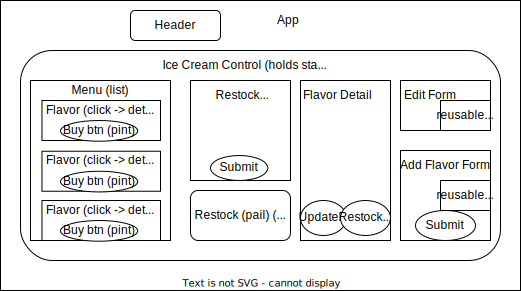

# Praline's Own Made Ice Cream
## Local Business Inventory Tracker, now with Redux!

#### By Kim Robinson

## Component Diagram
 

## Technologies Used

* Html
* Javascript, ES6
* CSS
* Bootstrap
* create-react-app
* Jest TDD testing
* React
* npm 
* ESLint
* uuid
* Git
* Redux toolkit

## A code review for Epicodus to demonstrate a redux refactor of a React application, including testing. 

###  This app will allow a user to:
    -see a menu of available flavors 
    -(each flavor will have at least 4 assigned properties )
    -submit a form to add a pail (130 pts) to the inventory
    -click on pail to see details
    -see how many servings left in pail
    -click button to sell 1 pint, which will decrement pail by 1 pint.

## Setup/Installation Requirements

1. Navigate to [my github repository](https://github.com/kimmykokonut/inventory-tracker-cra-redux) for this project 

2. Click the `Fork` button and  you will be taken to a new page where you can give your repository a new name and description. Choose "create fork".

3. Click the `Code` button and copy the url for HTTPS.

4. On your local computer, create a working directory for my files and name appropriately.

5. On your terminal, type `$ git clone 'url'` (using the url from step 3.)

6. On your terminal, type `$ code .` to open in VS Code.  If you do not have VS Code Editor, you may download [here](https://code.visualstudio.com/)

7. Once in VS Code, open the terminal there and type 
`$ npm install` (to install the packages and dependencies). 
You may also need to install bootstrap and uuid with these terminal commands: `$ npm install bootstrap`, 
`$ npm install uuid`

8.  Now you can access my code. 
* To launch the dev server, run `$ npm run start`
* To build the project for production, run `$ npm run build`

_If this is too much and you just want to see what it looks like, go to my [github pages](https://kimmykokonut.github.io/inventory-tracker-cra-redux)_

### Optional:
* To learn more about npm, [go here](https://www.freecodecamp.org/news/what-is-npm-a-node-package-manager-tutorial-for-beginners/)
* To learn more about Redux Toolkit, [go here](https://redux-toolkit.js.org/introduction/getting-started)

## Known Bugs
* App functional but room for improvement
* I would like to have a message print if inventory gets to zero or disable the Buy pint button
* It would be nice to make the header functional once I attain those skills
* Styling not as desired, focus was on React functionality

## License
MIT License. See license.md for further information